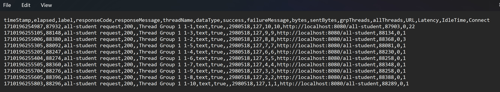

> Fari Hafizh Ramadhan - 2206083691

# Modul 5: Java Profiling

## Refleksi

1. JMeter dimanfaatkan untuk mengevaluasi kinerja aplikasi dengan mensimulasikan situasi beban kerja yang tinggi, menciptakan kondisi di mana aplikasi digunakan oleh sejumlah besar pengguna secara bersamaan. Di sisi lain, Intellij Profiler digunakan untuk mengidentifikasi titik-titik lemah dalam aplikasi yang mengakibatkan penurunan kinerja atau kecepatan yang buruk.

2. Proses analisis profil sangat bermanfaat dalam mengidentifikasi titik-titik kelemahan pada aplikasi yang mengakibatkan penurunan kinerja. Saat menjalani tahap ini, profiler akan mengumpulkan data serta menganalisis area yang menjadi hambatan. Data yang terkumpul dapat mencakup penggunaan CPU, alokasi memori, aktivitas pengumpulan sampah, dan tingkat konkurensi thread.

3. Ya, kehadiran fitur Profiler yang terintegrasi dengan IDE sangat membantu saya dalam menganalisis dan mengidentifikasi bottleneck dengan efisien. IntelliJ Profiler memungkinkan saya untuk mengakses visualisasi hasil evaluasi performa seperti Flame Graph, Daftar Metode, dan berbagai fitur lainnya. Informasi yang disediakan juga sangat komprehensif, termasuk data tentang CPU Time, Total Time, dan penggunaan memori oleh program. Dengan dukungan dari IntelliJ Profiler, saya dapat mengevaluasi performa kode dengan lebih efektif dan efisien.

4. Tantangan yang saya hadapi dalam melakukan pengujian kinerja dan analisis profil meliputi:
   - Interpretasi Hasil Profiling: Saya perlu memiliki pemahaman yang mendalam dalam menganalisis hasil profil untuk dapat mengidentifikasi area yang memerlukan perbaikan.
   - Pelaksanaan Optimisasi: Setelah menemukan titik lemah, saya harus melakukan perbaikan pada area tersebut untuk meningkatkan kinerja aplikasi. Proses ini merupakan tantangan yang signifikan bagi saya.

5. Beberapa manfaat yang diperoleh dari penggunaan IntelliJ Profiler termasuk kemudahan dalam melakukan analisis profil berkat integrasi yang kokoh antara IDE dan Profiler. Antarmuka yang ramah pengguna juga mendukung dalam memahami hasil evaluasi yang telah dilakukan. Hal ini memungkinkan pengembang untuk memanfaatkan informasi CPU Time, Total Time, dan Manajemen Memori yang diberikan oleh IntelliJ Profiler secara efektif dalam melakukan optimasi kode.

6. Saya jarang mengalami ketidak konsistenan hasil dari kedua alat tersebut. Namun, jika saya mengalami situasi tersebut, langkah pertama yang saya ambil adalah melakukan pengecekan ulang terhadap konfigurasi yang telah saya atur di JMeter dan memeriksa kembali hasil analisis profil yang telah saya peroleh dari Intellij Profiler. Jika masalah masih berlanjut, saya akan mencari tahu penyebabnya melalui mesin pencari atau berkonsultasi dengan dosen, asisten dosen, atau rekan saya.

7. Setelah menganalisis hasil performance testing dan profiling, langkah-langkah optimasi kode yang saya lakukan meliputi:
   - Memperhatikan hasil profil untuk mengidentifikasi method dan resource yang paling memakan waktu.
   - Mendalami kode untuk menemukan area yang dapat dioptimalkan.
   - Memilih algoritma dan struktur data yang optimal untuk setiap method.
   - Mengenali bagian kode yang dapat dieksekusi secara parallel dan menerapkan teknik threading atau multiprocessing.
   - Setelah melakukan perubahan, memastikan bahwa kode tetap berfungsi dengan melakukan pengujian yang komprehensif.
  
## JMeter Report and Test Results  

1. all-student
   - Before Optimization
     
   - After Optimization
      
   - Test Result
      

2. all-student-name
   - Before Optimization
      
   - After Optimization
     
   - Test Result
     

3. highest-gpa
   - Before Optimization
     
   - After Optimization
     
   - Test Result
     

   Berdasarkan screenshot-screenshot tersebut, dapat terlihat bahwa Sample Time method sebelum dioptimasi lebih lama dibandingkan setelah optimasi. Oleh karena itu, dapat disimpulkan bahwa proses optimasi yang dilakukan dapat terbilang berhasil untuk membuat kode lebih efektif dan efisien.
